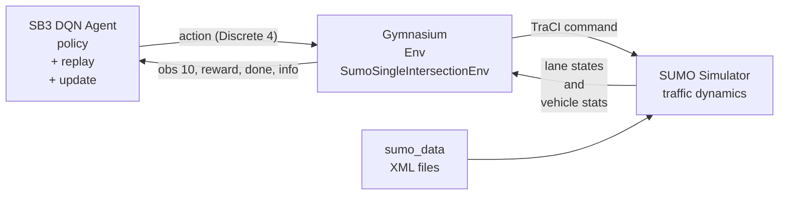

# SUMO + Gymnasium + SB3 단일 교차로 신호제어 (DQN)

수업용 최소 실습 구조
단일 교차로 환경에서 `Discrete(4)` 행동으로 신호 제어

## 시작 전 설치 (필수)

루트 프로젝트 기준 공통 Python 의존성은 먼저 아래로 설치

```bash
cd /home/kafa46/studies/reinforce_learning/play_with_sb3
python3 -m venv .venv
source .venv/bin/activate
python -m pip install --upgrade pip
pip install -r requirements.txt
```

### 1) SUMO 바이너리 설치 (시스템)

Python 코드 외 SUMO 실행 파일 필요

- `sumo`: 시뮬레이션 엔진(헤드리스) 실행
- `netconvert`: `nodes/edges/connections/tls` 파일을 도로 네트워크(`.net.xml`)로 변환

우분투/데비안

```bash
sudo apt update && \
sudo apt install -y \
  sumo \
  sumo-tools \
  sumo-doc
```

설치 확인

```bash
which sumo && \
which netconvert && \
sumo --version && \
netconvert --version
```

### 2) Python 패키지 설치 (가상환경 권장)

이 모듈은 루트 `requirements.txt` 기준으로 의존성을 관리
아래는 핵심 패키지 역할 설명

- `gymnasium`: RL 환경 인터페이스(`reset`, `step`, `observation/action space`)
- `stable-baselines3`: DQN 알고리즘 학습 프레임워크
- `numpy`: 관측/보상/지표 수치 계산
- `pandas`: 평가 결과 CSV 저장/집계 (`gradio 4.21.0` 환경은 `pandas<3.0` 권장)
- `imageio`, `imageio-ffmpeg`: 프레임 배열 mp4 인코딩
- `traci`: Python에서 SUMO 시뮬레이터 제어 인터페이스
- `sumolib`: SUMO 유틸리티(예: 바이너리 경로 탐색)

설치 확인

```bash
python -c \
  "import traci, sumolib; print('python deps ok')"
```

선택 사항(`traci/sumolib`를 SUMO tools 경로로 쓰는 환경)

```bash
export SUMO_HOME=/usr/share/sumo
export PYTHONPATH="$SUMO_HOME/tools:$PYTHONPATH"
```

영구 적용(`~/.bashrc` 등록)

```bash
echo 'export SUMO_HOME=/usr/share/sumo' >> ~/.bashrc
echo 'export PYTHONPATH="$SUMO_HOME/tools:$PYTHONPATH"' >> ~/.bashrc
source ~/.bashrc
```

## 폴더 구조

- `env_sumo_single.py`: Gymnasium 환경 (SB3 DQN용)
- `env_sumo_pz.py`: PettingZoo Parallel 환경 (RLlib MAPPO용, 다중 교차로 확장 가능)
- `train_dqn.py`: SB3 DQN 학습
- `train_mappo.py`: RLlib MAPPO 학습
- `evaluate.py`: DQN vs Fixed-time 지표 집계 + CSV 저장
- `record_video.py`: 최종 정책 실행 영상(mp4) 생성
- `sumo_data/`: SUMO 네트워크/경로/신호/설정 파일

## 행동/관측/보상

- 행동(`Discrete(4)`)
  - `0`: North-only green (직진+좌회전)
  - `1`: South-only green (직진+좌회전)
  - `2`: East-only green (직진+좌회전)
  - `3`: West-only green (직진+좌회전)
- 관측(`shape=(10,)`)
  - 각 방향 queue length (4)
  - 각 방향 평균 속도 (4)
  - 현재 phase (정규화) (1)
  - phase 유지 시간 (정규화) (1)
- 보상
  - `reward = - total_queue_length`
- 제약
  - phase 변경 시 yellow 삽입
  - minimum green time 적용

## SB3-Gymnasium-SUMO 관계도



- SB3는 학습 알고리즘(DQN)을 제공하고, Gymnasium 인터페이스를 통해 환경과 상호작용합니다.
- Gymnasium 환경(`env_sumo_single.py`)은 SUMO를 직접 제어/조회하는 어댑터 역할을 합니다.
- SUMO는 실제 교통 시뮬레이션 상태를 계산하고, 환경은 이를 관측/보상으로 변환해 에이전트에 반환합니다.

## 평가 지표

- `avg_waiting_time`
- `avg_travel_time`
- `total_queue_length` (에피소드 동안 누적)
- `throughput` (도착 차량 수)

## 실행 순서

### DQN (SB3 / 단일 에이전트)

1. DQN 학습

```bash
python train_dqn.py --timesteps 120000
```

2. 성능 평가(DQN vs Fixed-time)

```bash
python evaluate.py --model models/dqn_sumo_single.zip --episodes 5
```

- 결과 CSV: `results/eval_metrics.csv`

3. 정책 영상 생성(mp4)

```bash
python record_video.py --model models/dqn_sumo_single.zip --output videos/dqn_policy_rollout.mp4
```

### MAPPO (RLlib / 멀티에이전트)

1. MAPPO 학습 (저장 경로 자동 버전: `models/MAPPO_sumo_1`, `models/MAPPO_sumo_2`, ...)

```bash
# 테스트 (20 iter ≈ 80k steps, ~5분)
python train_mappo.py --num-iters 20 --num-workers 0

# 풀 학습 (300k steps 수준)
python train_mappo.py --num-iters 100 --num-workers 0

# 저장 경로 직접 지정
python train_mappo.py --num-iters 100 --out models/MAPPO_sumo_test
```

- 체크포인트: `models/MAPPO_sumo_N/` (디렉터리 형식, RLlib 포맷)
- 복원: `from ray.rllib.algorithms.ppo import PPO; algo = PPO.from_checkpoint("models/MAPPO_sumo_1")`

## TensorBoard

학습 중 또는 학습 후 별도 터미널에서 실행

```bash
# DQN + MAPPO 동시에 보기
tensorboard --logdir results/

# MAPPO만 보기
tensorboard --logdir results/tb_mappo

# DQN만 보기
tensorboard --logdir results/tb_dqn
```

브라우저에서 `http://localhost:6006` 접속

| 알고리즘 | 로그 경로 | 주요 지표 |
|---|---|---|
| DQN | `results/tb_dqn/` | `rollout/ep_rew_mean`, `train/loss` |
| MAPPO | `results/tb_mappo/MAPPO_sumo_N/` | `reward/mean`, `loss/total`, `loss/policy`, `loss/value` |

## 참고

- `sumo-gui` 대신 `sumo` 기반 실행
- 영상은 `env.render()` 프레임을 모아 mp4 인코딩
- 학습 과정 전체 영상은 별도 콜백 기반 프레임 저장 로직 추가 방식
- SB3 모델 저장 기본 포맷은 zip 아카이브, 확장자는 `.zip` 권장
- `.model` 확장자도 사용 가능, 내부 포맷은 동일하게 zip
- SUMO 시뮬레이션은 CPU 기반 실행
- SB3(DQN, PyTorch)는 GPU 사용 가능, 단일 교차로 소형 실습에서는 CPU 실행이 일반적
